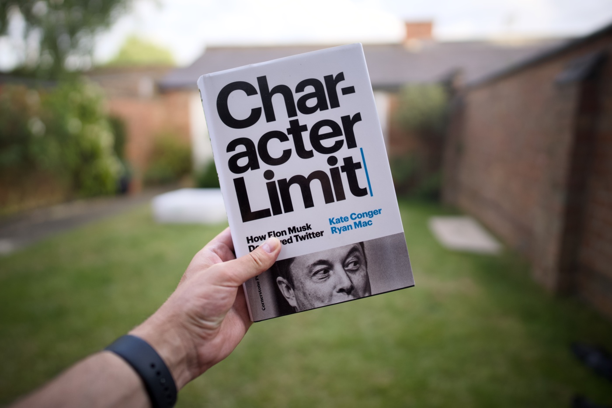

There is no other social media platform on which I spend as much time as Twitter. It’s a space where I used to learn and get inspired, I met some good friends there and it gave me a number of professional opportunities. It all collapsed when the narcissistic CEO of Tesla and SpaceX decided to prove to the world what money can buy, and acquired Twitter for £44 billion in October 2022. This marked the end of my affection for the platform and, like many other software enthusiasts, [I moved to Mastodon](https://mastodon.social/@pawelgrzybek). Thanks, Elon, without you the Fediverse wouldn’t be that strong! Nowadays I also cross-post to [Bluesky](https://bsky.app/profile/pawelgrzybek.com), but Mastodon is the one that I foresee myself using long term and potentially exclusively, but this is a conversation for another day.

This acquisition wasn’t an ordinary one as it was full of controversy and dick moves by Elmo. As soon as I came across ["Character Limit" by Kate Conger and Ryan Mac](https://www.goodreads.com/book/show/209543060-character-limit), I purchased the audiobook. It is a long and detailed story of the takeover, and it covers plenty of pre- and post-acquisition context. From Twitter's inception, the story of the founders through Twitter's transformations and financial difficulties up to the rapid team reorganisation, firing most of the staff and totally destroying the platform. At times, the book delves too much into detail about less relevant aspects. Overall, I found the story engaging and highly recommend the book.

That may be a shocking read for some of Elon Musk's fans as it presents him as a thin-skinned, cruel douchebag and ridiculously impulsive egocentric. I admire his visionary engineering, but at this point, he is a pathetic, Nazi-saluting clown to me.

Fuck Elon. Fuck Twitter. I will [see you on Mastodon](https://mastodon.social/@pawelgrzybek) 👋
