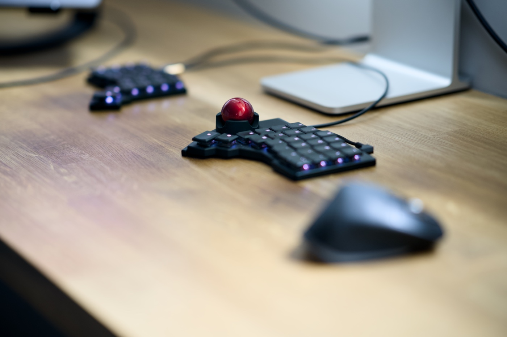

I'm a huge fan of ZSA. Their [Voyager keyboard](https://www.zsa.io/voyager) changed the way how I work, and it was the first keyboard that made me think about typing on the keyboard seriously. I published my thoughts about it in the ["A month with the ZSA Voyager split keyboard"](/a-month-with-the-zsa-voyager-split-keyboard/) some time ago, and today I like it even more. Overall, ZSA is a bunch of hard-working folks who genuinely care, [which is a rare thing nowadays](https://dansinker.com/posts/2025-05-23-who-cares/).

The moment they dropped the news about [the Navigator](https://www.zsa.io/voyager/navigator), I ordered one. After the currency conversion, it was around £125 and it arrived after a week in the UK. To my surprise, I didn't have to pay any additional duty fees as I had when I got a keyboard a few months back.

Worth noting that I'm OK with my [Logitech MX Master 3S](https://www.logitech.com/en-gb/shop/p/mx-master-3s-mac-bluetooth-mouse.910-006571). I don't love it as much as some other folks do, and other than [some crazy software fuck-ups](/from-logitech-mx-master-3s-to-apple-magic-trackpad-my-honest-review-of-the-ai-hype/) they had some time ago, this is a good tool and has been serving me well for the past few years. I don't struggle with RSI or any other discomfort. I ordered the Navigator out of sympathy to ZSA mainly, but also curiosity. Trying new things is good!

The moment it arrived I switched my Logitech mouse off and forced myself to use the Navigator as the only pointing device. At this point I have been using it for a week, and here is all you care about if you visited this post. Let's go!

## Good

- Lovely packaging, carrying case and cables. Braided cables that come with Navigator are a lot nicer than the stock one that the Voyager comes with.
- Installation takes seconds, and the rare magnets keep it in place really well. After attaching it really feels like a single unit device. No rattling whatsoever.
- Adding the device in Oryx creates a new mouse layer for you if you don’t have one already. They made this process really smooth.
- Build quality is superb, and Navigator looks OK. Don’t love it but don’t hate it.

## Not so good

- The slight tilt of one half of the keyboard added by attaching a new device is not an issue for me, but the fact that they are different bothers me a little. A little shim to attach to the opposite half would be a nice addition to the package.

## Notes

- The default mouse layer implicitly added when I registered the Navigator added "Toggle scroll" and "Lock layer" and I have absolutely no clue how they work. I disabled them as they gave just a headache. If someone can explain how to use them, I will be super thankful.
- I had to tweak some settings on the Navigator, as I found the default values to be way too sensitive for my fat fingers.

---

Let me know your thougts about the Navigator if you have one. If not, maybe this post halped you out to made a purchase decision. Have a good day folks and remember to keep it fun 💃🕺
