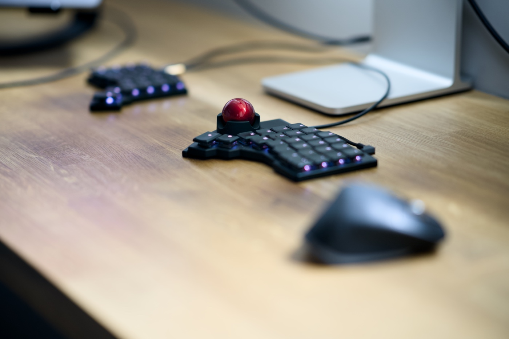

I'm a huge fan of ZSA. Their [Voyager keyboard](https://www.zsa.io/voyager) changed the way how I work and massively increased my typing speed, accuracy and comfort. I published my thoughts about it in the ["A month with the ZSA Voyager split keyboard"](/a-month-with-the-zsa-voyager-split-keyboard/) some time ago. ZSA is a bunch of hard-working folks who genuinely care, [which is a rare thing nowadays](https://dansinker.com/posts/2025-05-23-who-cares/).

The moment they dropped the news about [the Navigator](https://www.zsa.io/voyager/navigator), I ordered one. After the currency conversion, it was £125 and it arrived after a week in the UK. To my surprise, I didn't have to pay any additional duty fees as I had when I got a keyboard a few months back.

Worth noting that I'm OK with my [Logitech MX Master 3S](https://www.logitech.com/en-gb/shop/p/mx-master-3s-mac-bluetooth-mouse.910-006571). I don't love it as much as some other folks do, and other than [some crazy software fuck-ups](/from-logitech-mx-master-3s-to-apple-magic-trackpad-my-honest-review-of-the-ai-hype/) they had some time ago, this is a good tool and has been serving me well for the past few years. I don't struggle with RSI or any other discomfort. I ordered the Navigator out of sympathy for ZSA mainly, but also curiosity. Trying new things is good!

The moment it arrived I switched my Logitech mouse off and forced myself to use the Navigator as the only pointing device. At this point I have been using it for a week, and here is all you care about if you visited this post. Let's go!

## Good

- Quality! Starting with a lovely packaging, a carrying case and braided cables (much nicer than the ones you got with your Voyager). The build feels solid and the design is nice.
- Installation takes seconds, and the rare magnets keep it in place really well. After attaching, it feels like a single unit device. No rattling whatsoever.
- Adding the device in Oryx creates a new mouse layer for you if you don’t have one already. They made this process really smooth.
- There is no learning curve. You just need to understand how it works and your flow is almost uninterruppted event if this is your first experience with a device like this, as it was for me.

## Not so good

- The slight tilt of one half of the keyboard added by attaching a new device is not an issue for me, but the fact that they are different bothers me a little. A little shim to attach to the opposite half would be a nice addition to the package.
- Despite the configurable delay that disables the moouse layer after the specified inactivity, this delay is inconsistent and it distrupts my flow.
- The experience of using the cursor pointer with both hands is simply not for me. I didn't realise how often I click or drag with modifiers. I know it is possible to do it with Navigator, it is just too hard and requires me to think too hard about key combination instead of doing what I suppose to do.

## Great product, but not for me

It is a fantastic product, nicely designed, well priced and for most people will totally replace a mouse. Unfortunatelly the more complicated workflows that require holding modifiers put me out of the flow too much, to the point that I decided to sell it and welcome my good old Logitech mouse back to my desk.

<del>If you're in the UK and keen to get one, please let me know, I will give you a good price 💰</del>


It's not longer available, sorry. A kind Reddit user bought it 10 minutes after I published this article.


---

Let me know your thougts about the Navigator if you have one. If not, maybe this post halped you out to made a purchase decision. Have a good day folks and remember to keep it fun 💃🕺
