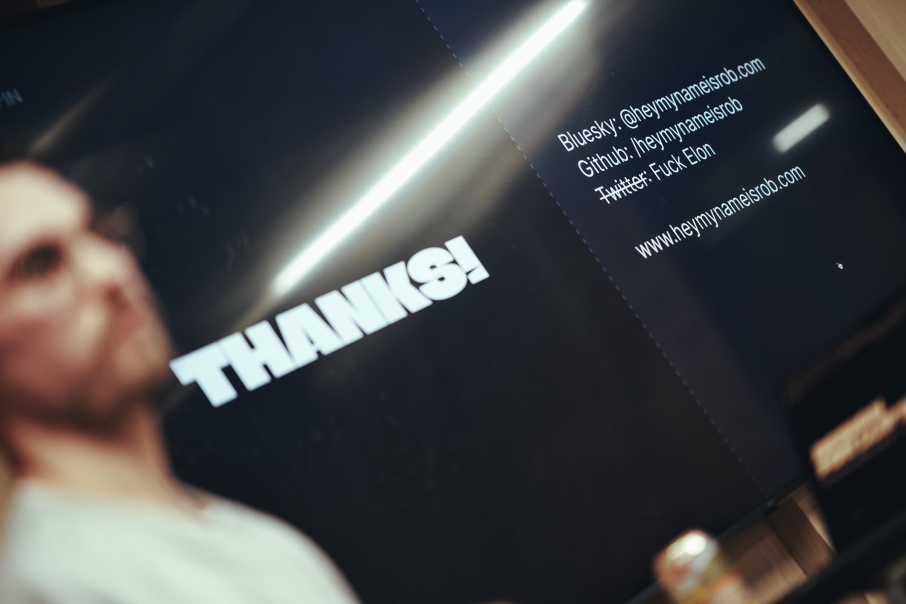

Last year we spent the end of December in Portugal, which started a new family tradition of travelling abroad for the Christmas season. We don't like the cold, Mariah Carey and George Michael songs are not particularly to our taste, and overeating Christmas food just because it’s the holiday season is disgusting.

We are in Sri Lanka now, the epicentre of insane tuk-tuk drivers, coconut roti heaven, and whether you like it or not, the place where you share your holiday house with house geckos. We arrived here in early December and we are coming back to the UK just by the end of the year. It's a good breather to reflect on the past year and continue the annual tradition of publishing a yearly recap.

I'm lucky that in these very uncertain times, my year was good! Very stable, healthy and filled with happiness. My family and looking after my gang give me a deep sense of fulfilment in life and I'm extremely grateful for having such beautiful people around. There are some other personal and professional aspects of life that I would like to tell you about which make me happy and miserable.

## Wifey

My best friend, someone who I love sharing every moment with, a person who inspires me and gives me a purpose for constant improvement, the most incredible mother for our kiddo, and totally the sexiest human on the planet, became my wife.

## Personal transformation

This was a year of big transformation for my body and self-esteem. It all started with a strict keto diet which always worked wonders for me, but this time, I kept the eating regimen for long enough so the good eating habits stayed. On top of the diet, I started running weekly 5km parkruns with my friend Olivier. Observing how much good food affects running performance, and how much a little bit of cardio boosts my productivity, kept me going.

As a result, I reached my weight goal and lost 11 kg, and for the first time in a decade, I'm genuinely happy in my own body. Buying new clothes is no longer a chore of choosing something that doesn't make me look fatter, but has become an enjoyable process of picking the stuff I really like. I still don't like having a lot of clothes, but at least the motivation of buying new ones has changed. This was a huge physical and mental win for me in the past year.

## Go

I dedicated a significant part of my career to the Rust programming language. I started using it professionally three years ago at Polygon, and I really delved into the ecosystem. I participated in a number of open-source Rust-based projects and reached the point where I was comfortable using it.

When I joined [Avantarte](https://avantarte.com/) almost two years ago, I was a little bit sad that Rust was not part of their stack. Tech-wise, Avantarte has a few Next.js applications on the frontend and a number of backend microservices written in Go. Even though the Go side of the tech stack was not within the scope of my responsibilities, I learnt the basics of this language and started contributing. Thanks to Amin, who is a great developer and the Go ambassador at Avantarte, I quickly became productive using it.

Exposure to Go made me realise how much I don’t want to use Rust anymore. Rust is a fantastic language, with fantastic tooling and a fantastic ecosystem, but not for the things I enjoy building. Learning Go made me a much better web developer, and building web applications is all I want to do. The web is fun, and making it a better place makes me happy. Huge realisation of the year and huge skills adjustment!

## NN1 Dev Club

It was another big and transformative year for [NN1 Dev Club](https://nn1.dev/), the meetup I organise. The thing that started as an idea for a little get-together of a few local geeks became the most popular event of its kind ever hosted in Northamptonshire. The hard work and tons of heart I poured into it have finally been appreciated by the members, and I feel that I am not on my own anymore. It is incredible to see all these business opportunities and friendships that the community has enabled. I have really exciting plans and speakers lined up for 2026, so you'd better stay tuned.

Thanks to [Darren](https://www.linkedin.com/in/staffordsharp/), whom I co-organise it with, and his incredible family, without whom the NN1 Dev Club wouldn't exist. Thank you to all engineers who got involved in the organisation process and all those who contributed to the codebase. Huge thanks to all financial contributors on [our Open Collective page](https://opencollective.com/nn1-dev). Thanks to the local council and university, which provide constant support for our initiative. From the bottom of my heart, thank you all!

## The bubble is gonna burst

That's the miserable part of this article. The tech scene has never been more boring and soulless than it is now. Tech news is all about benchmarks of AI models, everyone is bragging about increased productivity and how much money they managed to save by laying off half of the team. What I see as a net result of it is a global degradation of software quality. What we are about to see in the future is a lot worse and it is not going to affect only the software sector but the society as a whole. I'm scared!

Do not get me wrong, I use AI tools daily and I'm not against them. I'm just a sceptic to say the least. I'm terrified about the way others use it and how big tech giants want us to use their products.

I don't have a great conclusion for this section, so let me leave you with a simple ask. Build your website, make the web fun again. Work on your critical thinking. Be a human! No one cares about the AI-generated picture of you starring in the Western movie. No one!

## Blogging

Looking at the blog post count per year, this was the slowest year in the decade-old history of this blog, with only 35 articles published compared to 2023 when I published 61. It was just busy as hell and something must have been sacrificed in life. Just as I hoped last year, I would love to find more time for writing in the upcoming year. I do believe that having a truly personal website is more important than ever to preserve some humanity on the web. Build your website, folks!

In the past year I published a lot of tricks and tips kinda articles mainly about Vim. Since modal editors became my new passion last year, I cannot stop digging deeper into this subject. Using simple tools like Vim gives me a level of control and satisfaction in contrast to using the bloated, AI-integrated modern IDEs.

- [Neovim file explorers](/neovim-file-explorers/)
- [Highlight yanked text in Neovim](/highlight-yanked-text-in-neovim/)
- [Vi keybindings in fish shell](/vi-keybindings-in-fish-shell/)
- [Reconcile two conflicting LSP servers in Neovim 0.11+](/reconcile-two-conflicting-lsp-servers-in-neovim-0-11/)
- [Neovim incremental selection using Tree-sitter](/nvim-incremental-selection/)
- [Make Vim macros fun to work with](/make-vim-macros-fun-to-work-with/)

Since I started using modal editors, I started paying more attention to my typing. Literally I'm talking about bashing keys on my keyboard, which is all I do as a programmer. My friends hooked me on the split keyboards and that became a little hobby of mine. I tested some gear and settled on a setup that makes me more productive than ever before and brings me tons of joy. I also published a few posts on this subject that I am proud of, although the one that concludes this whole journey and the detailed review of my Kinesis Advantage 360 Pro setup is coming at some point in early 2026.

- [A month with the ZSA Voyager split keyboard](/a-month-with-the-zsa-voyager-split-keyboard/)
- [A week with the ZSA Navigator](/a-week-with-the-zsa-navigator/)

Not only did blogging slow down, but my social media activities also relaxed. Since I abandoned Twitter (which you should also do) the only place where you can find me active is [Mastodon](https://mastodon.social/@pawelgrzybek). I also crosspost to [Bluesky](https://bsky.app/profile/pawelgrzybek.com) purely for visibility but I don't care about this platform too much. I cannot clearly articulate my reasoning between Mastodon and Bluesky, but something about the values, long term vision, and sustainability model tells me to ignore Bluesky. In the end, Mastodon is just a personal preference for my ephemeral thoughts, but the only place on the web I really pay attention to is my website. Build your website!

## Next year's focus

I'm planning to continue working on my physical health and I expect my mental health will follow. We are planning to convert our dusty garage into a little gym this year, so hopefully adding some lifting on top of my running and healthy diet will help.

From a tech and professional perspective, I have some plans for this website, continuous improvements to the NN1 Dev Club community, and plan to release a little project that I've been working on for a while now. This blog needs some TLC. The syntax highlighting is far from perfect and it is driven by the outdated Hugo API, so I would like to rebuild this part. Image management is pretty tedious and very manual. Hugo can also help to automate this part. The archive and my music page need a redesign. I really want to give this website a little bit more love.

## How about you?

I love reading annual recaps of other indie web folks. I'm genuinely curious how other fellow programmers balance their digital and personal life. What are your achievements and struggles? Here are some links to my web friends' reviews. I'm going to keep on adding to this list as I read more of your posts. Send them my way please.

- ["I Survived 2025" by David Bushell](https://dbushell.com/2025/12/18/year-in-review/)
- ["Wrapping up 2025 (sort of)" by Andy Bell](https://bell.bz/wrapping-up-2025-sort-of/)
- ["2025 in review" by Cory Dransfeldt](https://www.coryd.dev/posts/2025/2025-in-review)
- ["My 2025 review" by Hidde de Vries](https://hidde.blog/2025-review/)
