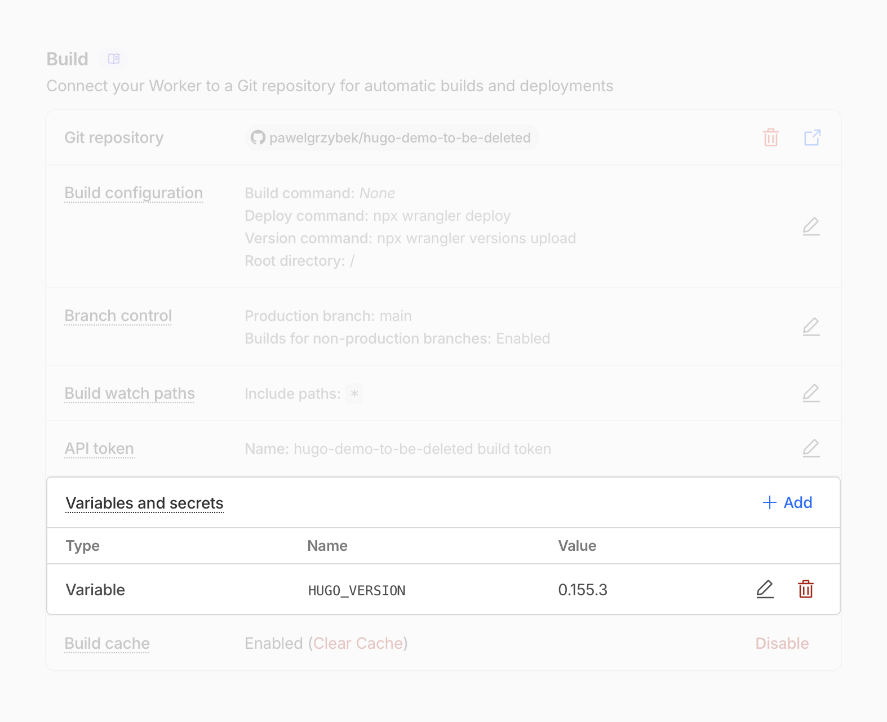

The Cloudflare team clearly stated that [we should prefer Workers over Pages](https://blog.cloudflare.com/full-stack-development-on-cloudflare-workers/), and this is the one that’s going to get future improvements and optimisations.

> Now that Workers supports both serving static assets and server-side rendering, you should start with Workers. Cloudflare Pages will continue to be supported, but, going forward, all of our investment, optimizations, and feature work will be dedicated to improving Workers.

Back in June when [Cloudflare announced pay per crawl](https://blog.cloudflare.com/introducing-pay-per-crawl/) for AI crawlers, I miserably failed to migrate this very website to them. My site is a Hugo project, and [the only official guide](https://developers.cloudflare.com/pages/framework-guides/deploy-a-hugo-site/) for my static site generator is for Cloudflare Pages. Hugo documentation contains a detailed guide on [how to host on Cloudflare Workers](https://gohugo.io/host-and-deploy/host-on-cloudflare/), but this guide is a little too complex for my taste. I figured out a simpler approach that works for me.

The Cloudflare Workers runtime comes pre-built with `hugo` (standard, not the extended build) and `sass` executables along with [a gazillion of others](https://cf-clis.pawelgrzybek.workers.dev/) that the official docs never mention. Since [the release of v0.153.0](https://github.com/gohugoio/hugo/releases/tag/v0.153.0), the WebP support no longer requires the extended version of Hugo binary. This should work for most projects just fine. Here is the copy/pasta 🍝 `wrangler.jsonc` file!

```json
{
  "name": "hugo",
  "compatibility_date": "2026-02-17",
  "build": {
    "command": "hugo --gc --minify"
  },
  "assets": {
    "directory": "./public",
    "not_found_handling": "404-page"
  }
}
```

The pre-installed version of `hugo` may not be the one you want to use, but [same as on Cloudflare Pages](https://developers.cloudflare.com/pages/framework-guides/deploy-a-hugo-site/#use-a-specific-or-newer-hugo-version), you can control it by adding a `HUGO_VERSION` build environment variable. Make sure this is a build, not a runtime variable — this mistake wasted a few moments of my life in the past 🤦‍♂️



The downside of this approach is that you rely on the Sass version that comes with the runtime, rather than locking them to the exact version as per the Hugo docs recommendation. The plus though is that you don't need to maintain additional script files, nor install additional dependencies and you get a lot faster build time.

Huge thanks to Joe Mooring from the Hugo core team for [helping me out to identify pros and cons](https://discourse.gohugo.io/t/hosting-a-hugo-site-on-a-cloudflare-worker/55203/12) of both approaches.
