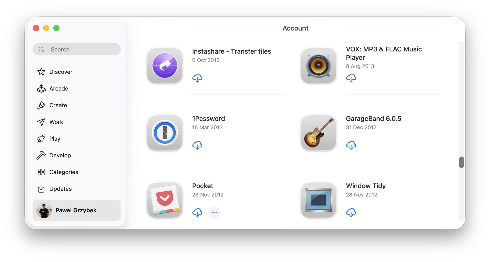
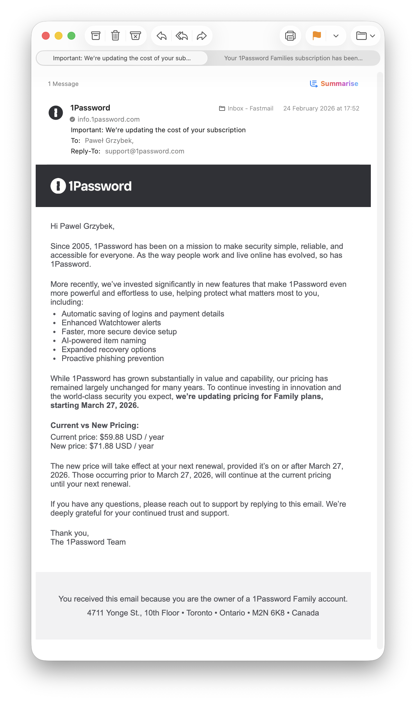
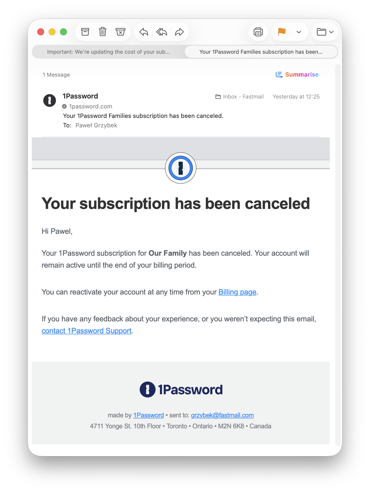

I have been a loyal customer of 1Password since 2013. It has served me well and I never really looked into the alternatives. I didn't mind occasionally paying for an upgrade to the newer version, or even switching to a subscription model a few years ago.

In recent years though, my list of frustrations with 1Password was growing. It all started when 1Password migrated from the native build to the Electron version for the desktop app. Things became sluggish. Not slow, but not natively fast. The browser extension became unreliable as well (random locks, syncing delays and unpredictable auto-fill), but I had no choice other than to keep using it. The app, from being a simple, super-fast and very reliable piece of software, became bloated and buggy eye candy.

Generating strong passwords and keeping them safe is all I expect from a password manager. I got it 13 years ago, so I care very little about the long list of new features in the changelog of new versions. The most recent "upgrade" to the app caught my attention and inspired me to switch.

The price bump is fair, I don’t blame them in the current economics. The "AI-powered item naming" feature though, is precisely the kind of feature I don’t want in my password manager. I can only envision the future direction of the company, that adds AI bloat where it's not needed. I’m tired of this!

## Why Apple Passwords

The list of alternatives is huge, but [I like defaults](/my-defaults-2023/). At this point I’m so locked into the Apple ecosystem that locking myself into it even more is not a concern any more, just a risk I accepted long ago. Apple Passwords is free.

I have seen stories of folks who have been locked out of their Apple iCloud accounts. Losing all the photos and contacts can be super sad, but losing all the passwords sounds like a freakin’ disaster to me. Years ago I started doing occasional backups of everything I care about, so now passwords are going to be included as well. I keep them encrypted on two physical drives and I hope I will never need to use them.

## Good & bad

I have been using Apple Passwords for a few days now, and I have some thoughts, things I like and dislike. I also have some side notes that are neither good nor bad, but worth keeping in mind if you’re going to pursue a similar move. I like lists, so here you go, three lists!

### Good:

- Apple Password is the stock app that comes pre-installed
- Instant boot up
- Auto fills are super fast, way faster than 1Password
- Minimalistic and familiar look
- Shared groups are way more powerful than 1Password vaults and don’t require any additional plans or family setup

### Bad:

- No tagging system, something I used heavily on 1Password
- Limited categories to Logins and Wi-Fi networks, so you must find an alternative place for secure notes, software licences and documents (I used password-protected Apple Notes)
- Setting up OTPs (one time passwords) works better in 1Password that can auto-detect the QR code on the screen

### Keep in mind

- Migration from one app to the other migrates only usernames, passwords, OTPs, and notes, leaving behind all the custom fields and the most important passkeys, so there is some extra manual work needed for the full migration
- The workflow changes a little bit, so I would suggest doing the migration as soon as possible, not the day before your 1Password plan expiration

## All done

There are some missing features of Apple Passwords that I hope are going to be added in future OSs, the pros outweigh the cons of this migration for me. I totally understand that this is not for everyone and there are still concerns that I didn't even mention (Windows/Linux compatibility or 1Password specific features like vaults travel mode just to name a few). I just hope someone who is considering a similar swap may find it useful.

