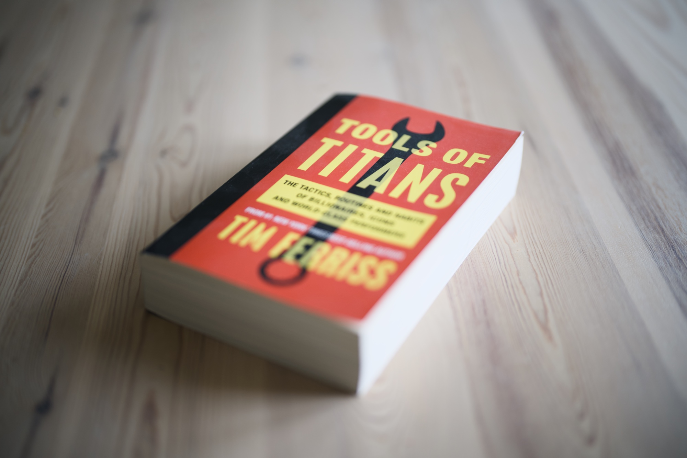

["The Tim Ferriss Show"](https://podcasts.apple.com/gb/podcast/the-tim-ferriss-show/id863897795) is one of the most popular podcasts in the world and follows a form of lengthy interviews with top performers from multiple areas, like business, tech, sport and finance. I don't follow it religiously, but I listened to some of these chats before and I like the non-scripted format of easy chats.

["Tools of Titans"](https://www.goodreads.com/book/show/31823677-tools-of-titans) distils down the years of podcasting baggage, into the most insightful tips repeated over and over by Tim's interviewees. The book consists of multiple totally unrelated chapters that are either focused on the show's guests or a random subject summarised by Tim. I liked the fact that I could listen to this book on and off, as each of the sections had nothing to do with the previous one. Some of his guests are nuts!

In essence it is a series of practical advice you heard a gazillion times before. A lot about the diet, a lot about the investment strategies, tonnes of sports insights. The list of condensed interviews contains seriously interesting folks, like Rick Rubin, Jamie Foxx, Simon Sinek. It also contains tonnes about folks who I admire a lot less nowadays like Elon Musk and Jeff Bezos, but nonetheless they are also top performers so some of the stuff from their life was also interesting. Overall good read/listen, especially if you need a list of unrelated chapters that you can easily consume while hoovering and learn a thing or two while doing it.
