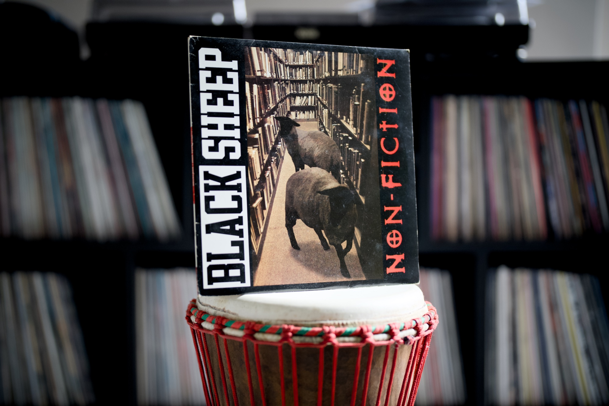

What a month! After losing a job at the end of January, I started looking for a new one straight away. Seeking a new job nowadays is very different from how it used to be. Very long, multi-step and mentally draining processes are the new norm. The recent explosion of AI tools makes things massively more complicated. Some companies force you to use Claude Code and others mandate disabling the autocompletion or even solving the problem on the whiteboard. When it comes to the number of available positions, things don't look as bad as people say, but the competition is high. Everything is just mad!

I'm happy to share that a few weeks ago I joined a new company as a Lead Engineer where I'll be working mainly on backend services written in Go. I had been preparing myself for a little break from the frontend for a while. I do love frontend and web standards, but I'm tired of the immaturity of the JS ecosystem. I'm tired of CSS-in-JS, Tailwind, frameworks battles and Vercel's CEO photos on Twitter. I'm worried about the surveillance forced upon web users, the quality and the direction of the dominant web services. I just need a break.

I have been writing Go for a while now, and using it has revived my passion for programming. I still learn a lot, but I'm extremely productive using it and the ecosystem and community of Gophers align with my values better.

Other than some exciting changes in my professional life, the past month has been busy on the Web and a lot of good resources popped up. I really hope you will like this month's selections. Music recommendation is as always here for ya. Enjoy!

---

## Album of the month

Black Sheep is a rather lesser-known part of the Native Tongues Collective. They are mainly known by their first album "A Wolf In Sheep’s Clothing," but the next, "Non-Fiction," released in 1994, is my favourite. I really like the vibe of ["City Lights"](https://youtu.be/9I8eSTgZiDY) and ["Summa Tha Time"](https://youtu.be/TUbgHAy9CB8). Also, the [European release of this album](https://www.discogs.com/release/2069035-Black-Sheep-Non-Fiction) says "Balck," not "Black" on the spine, which is a funny little mis-print.

---

## Top picks

### ["You can use newline characters in URLs" by Daniel Lemire](https://lemire.me/blog/2026/02/28/you-can-use-newline-characters-in-urls/)

Interesting little trick how you can abuse the spec for your convenience. It turns out that you can split URLs into multiple lines and the browser just ignores all the invalid tabs and newline characters.

### ["Nobody Gets Promoted for Simplicity" by Matheus Lima](https://terriblesoftware.org/2026/03/03/nobody-gets-promoted-for-simplicity/)

This is the harsh reality. I have been a victim of this multiple times, and the fact that I often describe my ways of working as a "simplicity guardian" is very rarely appreciated. Good write-up, Matheus, thank you.

### ["Too Much Color" by Keith Cirkel](https://www.keithcirkel.co.uk/too-much-color/)

Keith published this fantastic deep dive into the color precision in CSS. It contains a number of interactive demos and also he built a whole little game to support the idea conveyed in this post (try to beat my score of 0.0022). Really incredible research!

### [Evolving the Node.js Release Schedule](https://nodejs.org/en/blog/announcements/evolving-the-nodejs-release-schedule)

The release schedule of Node.js is changing, and things are becoming a lot easier. The current release schedule is a decade old, and barely anyone cares about odd versions. The new plan nicely aligns with the current year and there is no confusion about the LTS versions. Every release hits LTS in April each year.

### [Temporal: The 9-Year Journey to Fix Time in JavaScript](https://bloomberg.github.io/js-blog/post/temporal/)

I'm very lucky that I attended a talk by Jason Williams at the recent [State of the Browser conference](https://stateofthebrowser.com/), and this article is just a written version of it. It is a celebration of the Temporal proposal reaching stage 4, which means it is officially going to be part of ECMAScript 2026. Finally, the date/time in JavaScript is fixed.

> Earlier today, Temporal reached Stage 4 in the TC39 staging process, which means it will be part of the next annual ECMAScript specification (ES2026). However, you don't need to wait until then - you can use it today!

### ["Trash Talk - Understanding Memory Management" by Shelley Vohr](https://youtu.be/fJlW6HVfKFU)

Good talk by Shelley Vohr about the garbage collector in JavaScript (very V8 specific, but most of the concepts are also present in other engines). What it is, how it works, and how to optimise your application to make it more memory efficient. It presents a few not very obvious practical tips. Good one!

### [A Guide to vim.pack (Neovim built-in plugin manager)](https://echasnovski.com/blog/2026-03-13-a-guide-to-vim-pack#hooks)

Evgeni Chasnovski, one of the core contributors to Neovim and also a maintainer of a top collection of plugins from the `mini.nvim` family, published this incredible guide to the new, native way of managing packages. I'm looking forward to the upcoming stable release. The built-in package manager is one of the new add-ons I'm super excited about, along with tons of other improvements. This release is going to be a huge one. ["A Demo of vim.pack" by Evgeni Chasnovski on YouTube](https://youtu.be/J1r0vrqOMJo) is a video version of this blog post that nicely summarises the most important bits, although the blog post contains more more details.

### [50 Shades of Go: Traps, Gotchas, and Common Mistakes for New Golang Devs](https://golang50shades.com/)

This is over a decade-old resource that presents a miles-long list of common tips in the Go programming language. These things should be part of the official learning path for this language. I found some of these points so well explained, and for sure I will be coming back to this list a lot.

### [Concurrency, Goroutines and GOMAXPROCS](https://www.ardanlabs.com/blog/2014/01/concurrency-goroutines-and-gomaxprocs.html)

Concurrency in Go is a beauty if you understand how it works. Coming from other programming languages, it may be hard to grasp without a good real-life analogy. This post does a perfect job at explaining the concept. There is a follow-up post ["The Nature Of Channels In Go"](https://www.ardanlabs.com/blog/2014/02/the-nature-of-channels-in-go.html) that is a natural next step to embrace the two most powerful concepts in Go: goroutines and channels.

### [Some Things Just Take Time](https://lucumr.pocoo.org/2026/3/20/some-things-just-take-time/)

A beautiful essay by Armin Ronacher, creator of Flask, Pygments and plenty of other great open source projects. I love how he talks about the importance of friction in the peak of the AI momentum when automation maniacs do everything to remove friction. I can’t help it, but I also love the series of good analogies that this post is full of.

> Nobody is going to mass-produce a 50-year-old oak. And nobody is going to conjure trust, or quality, or community out of a weekend sprint. The things I value most — the projects, the relationships, the communities — are all things that took years to become what they are.
