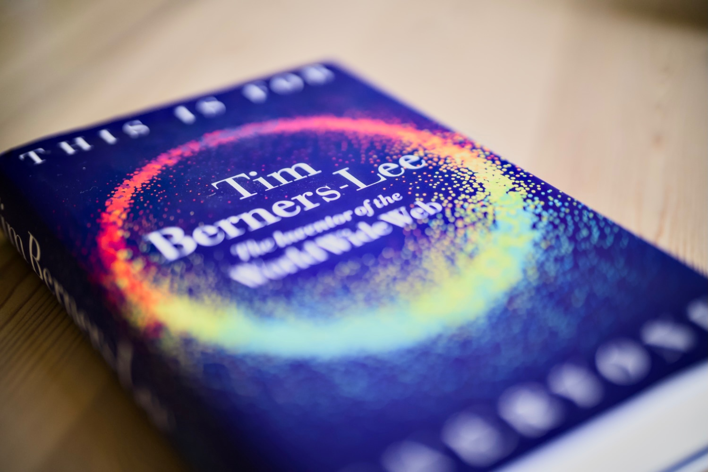
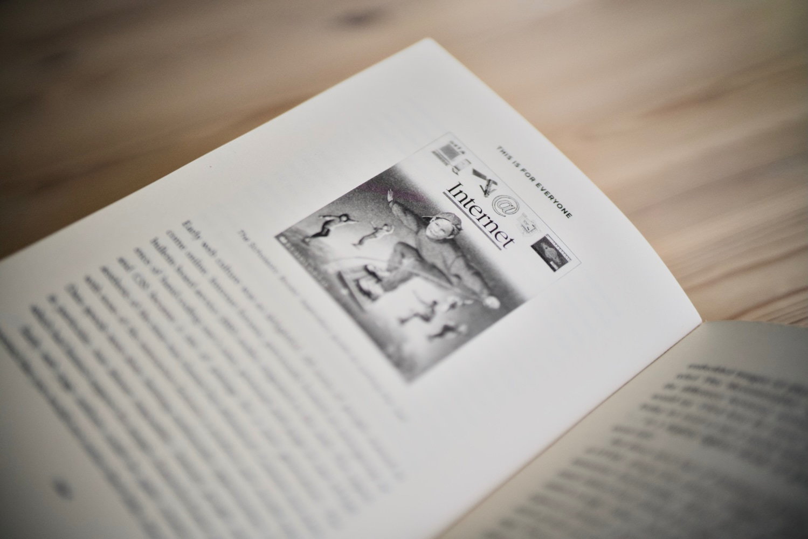

The World Wide Web is one of the greatest inventions of humanity. This medium gave me the opportunity to do what I do, made me passionate about it, taught me so many things and gave me so many laughs. In many contexts this saying sounds cliché, but without the internet this world really wouldn't be what it is now.

I'm a huge fan of Sir Tim Berners-Lee, his values and his modest and humble aura. I ordered a physical copy of ["This is for Everyone"](https://thisisforeveryone.timbl.com/index.html) the moment it came out, but I mostly listened to it on [Audible](https://www.audible.co.uk/pd/This-Is-for-Everyone-Audiobook/B0DK42QWHT), read by a great voice of Stephen Fry. The audiobook contains a great prologue read by the author, and also a (not so great) conversation between the web inventor and the narrator.

Book starts in a very biographical way by telling a little story of Tim's and his family, education and early career that eventually drove him to CERN. Inspired by the lack of interoperability between documents systems in the particle laboratory, he started constructing a mesh of interconnections. In fact "Mesh" was what Tim called his invention, but inspired by catchy names of products Steve Jobs liked to give to his products, he decided to call it World Wide Web.

The early days were rather tough and the book goes in depth about other competing protocols, first browser wars and attempts to monopolise the Internet. Throughout the book the author expresses his never-ending desire to keep the web open, valuable and accessible for everyone. On multiple occasions the author mentions the fear of fragmentation present on the web, domination of the social media silos and also the importance of the governance bodies behind them. The last chapters of the book go in depth (too much if you ask me) into the [SOLID protocol](https://solidproject.org/) that Tim has worked on for the recent years.

I would recommend it wholeheartedly to everyone, not only tech-savvy folk. Geeks will also find this read incredibly interesting as it reveals a lot of great stories about other tech makers of our generation, some drama behind the web clients, an interesting relationship between the author and the UNIX philosophy and tonnes more. I loved the read!
