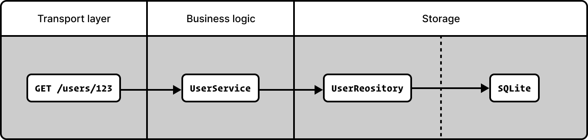

When you start a new project, it feels nice that everything lives in a single main.go file. When things start to grow, you split things into multiple files. We will add tests later, right? Requirements change, someone joins the team, and in the meantime, you swapped SQLite for Postgres. In no time, your pedantically maintained project became an untangled mess of layers dependent on each other, with no clear separation of concerns, and previously neglected tests are close to impossible to implement at this point. Some good habits are worth picking up from the get-go, and in the world of Go services, the [repository pattern](https://martinfowler.com/eaaCatalog/repository.html) is one of them.

> Conceptually, a Repository encapsulates the set of objects persisted in a data store and the operations performed over them, providing a more object-oriented view of the persistence layer. Repository also supports the objective of achieving a clean separation and one-way dependency between the domain and data mapping layers.

This is the definition from the classic ["Patterns of Enterprise Application Architecture" by Martin Fowler](https://martinfowler.com/eaaCatalog/repository.html), but the one from [".NET Microservices Architecture for Containerized .NET Applications" by the Microsoft team](https://learn.microsoft.com/en-us/dotnet/architecture/microservices/microservice-ddd-cqrs-patterns/infrastructure-persistence-layer-design) is way more human readable.

> The Repository pattern is a Domain-Driven Design pattern intended to keep persistence concerns outside of the system's domain model. One or more persistence abstractions - interfaces - are defined in the domain model, and these abstractions have implementations in the form of persistence-specific adapters defined elsewhere in the application.

The terminology here matters less than the principles. We want to achieve encapsulation, testability, scalability and the flexibility of swapping individual components with ease. Core concepts here are common for the repository pattern, service pattern and domain-driven design, hence I put less emphasis on the definition and more into the practicality.



No matter if you’re building a gRPC, HTTP or WebSocket streaming application, the same rules apply. The idea is that you won’t need to change a single line of business logic if you ever decide to change a storage layer (database). The biggest benefit of this pattern is the ease of testing layers in isolation. Swapping or adding an additional transport layer should also be easy. The contract between the layers is enforced by interfaces (what it does), but the individual parts shouldn’t be concerned about the implementation details (how it works).

## Practical example

Although the project structure is not related to the architecture, one influences the other. Having a background in other programming languages, you may be tempted to group files by modules (models, services, repositories etc.), but the domain-first approach better aligns with Go’s package philosophy. The ["Let the domain guide your application structure" by Redowan Delowar](https://rednafi.com/go/app-structure/) does an incredible job of explaining the difference between the application structure vs architecture and why the domain-driven one works better.

```
demo/
  ├── cmd/
  │   └── api/
  │       └── main.go
  ├── product/
  │   ├── product.go
  │   └── service.go
  ├── server/
  │   ├── handlerProduct.go
  │   ├── handlerUser.go
  │   └── server.go
  ├── sqlite/
  │   ├── repositoryProduct.go
  │   ├── repositoryUser.go
  │   └── sqlite.go
  └── user/
      ├── service.go
      └── user.go
```

Let's look at all the concepts involved one by one. For the sake of brevity, I only added bits related to one of the domains (`user`) here, but you can probably guess how all the others (`product` and potentially more) are implemented.

### Model

Top level model file is the place to describe its members, add validation rules, list domain-specific errors and define static struct methods.

```go
// user/user.go
package user

type User struct {
	ID   int    `json:"id"`
	Name string `json:"name"`
}
```

### Service

That's the place for the business logic and it depends on the repositories that are defined as interfaces. Service is aware of what kind of database operations we can make, but it doesn't care how they are made. The ease of dependency injection is the natural benefit of this design, so adding tests for this service are trivial. Just by looking at this file, you cannot even tell if we use Postgres, SQLite or DynamoDB as a storage for users. This is the essence of this pattern!

```go
// user/service.go
package user

import "context"

type Repository interface {
	List(ctx context.Context) ([]User, error)
}

type Service struct {
	repo Repository
}

func NewService(repo Repository) *Service {
	return &Service{repo: repo}
}

func (s *Service) List(ctx context.Context) ([]User, error) {
	return s.repo.List(ctx)
}
```

### Repository

This is the place that directly interacts with the database. The repository implements the interface of the service. If you ever need to change the database, this is the only place that needs changing, without touching a single line of code in the service layer.

```go
// sqlite/repositoryUser.go
package sqlite

import (
	"context"
	"database/sql"

	"demo/user"
)

type UserRepository struct {
	db *sql.DB
}

func NewUserRepository(db *sql.DB) *UserRepository {
	return &UserRepository{db: db}
}

func (r *UserRepository) List(ctx context.Context) ([]user.User, error) {
	query := `SELECT id, name FROM users`

	rows, err := r.db.QueryContext(ctx, query)
	if err != nil {
		return nil, err
	}
	defer rows.Close()

	var users []user.User
	for rows.Next() {
		var u user.User
		if err := rows.Scan(&u.ID, &u.Name); err != nil {
			return nil, err
		}
		users = append(users, u)
	}
	return users, nil
}
```

### Server

For the sake of the completeness of this example, this is how the super simplified version of the http server implementation looks like. Swapping to a different transport layer with this level of separation should also be easy, as the business logic is enclosed in the services.

```go
// server/server.go
package server

import (
	"net/http"

	"demo/user"
)

type Server struct {
	userHandler    *UserHandler
}

func NewServer(us *user.Service) *Server {
	return &Server{
		userHandler:    &UserHandler{service: us},
	}
}

func (s *Server) ListenAndServe(addr string) error {
	mux := http.NewServeMux()
	mux.HandleFunc("GET /users", s.userHandler.List)
	return http.ListenAndServe(addr, mux)
}
```

```go
// server/handlerUser.go
package server

import (
	"encoding/json"
	"net/http"

	"demo/user"
)

type UserHandler struct {
	service *user.Service
}

func (h *UserHandler) List(w http.ResponseWriter, r *http.Request) {
	users, err := h.service.List(r.Context())
	if err != nil {
		http.Error(w, err.Error(), http.StatusInternalServerError)
		return
	}
	json.NewEncoder(w).Encode(users)
}
```

### Wire it all up

```go
// cmd/api/main.go
package main

import (
	"log"

	"demo/product"
	"demo/server"
	"demo/sqlite"
	"demo/user"

	_ "modernc.org/sqlite"
)

func main() {
	db, err := sqlite.Config()
	if err != nil {
		log.Fatal(err)
	}
	defer db.Close()

	rUser := sqlite.NewUserRepository(db)
	sUser := user.NewService(rUser)
	svr := server.NewServer(sUser)
	svr.ListenAndServe(":8080")
}
```

Here you go, a simplified example of the repository pattern in a Go service. Following this simple technique makes your core easily testable, modular and scalable. Also, following the file structure suggested in this post makes finding files super intuitive, as everything has its place. Wonder no more where the database inserts or validation logic are declared.

Huge shout out to [Redowan Delowar](https://rednafi.com/) for the proof read and great pointers. If you don't follow his blog, you should subscribe to it now. Thank you!

I really hope that helps 🤗

## Resources

- ["Repository" by Martin Fowler](https://martinfowler.com/eaaCatalog/repository.html)
- ["Let the domain guide your application structure" by Redowan Delowar](https://rednafi.com/go/app-structure/)
- ["Clean Architecture -> Separation of concerns" by vjeran F.](https://vjerci.com/writings/clean/separation-of-concerns/)
