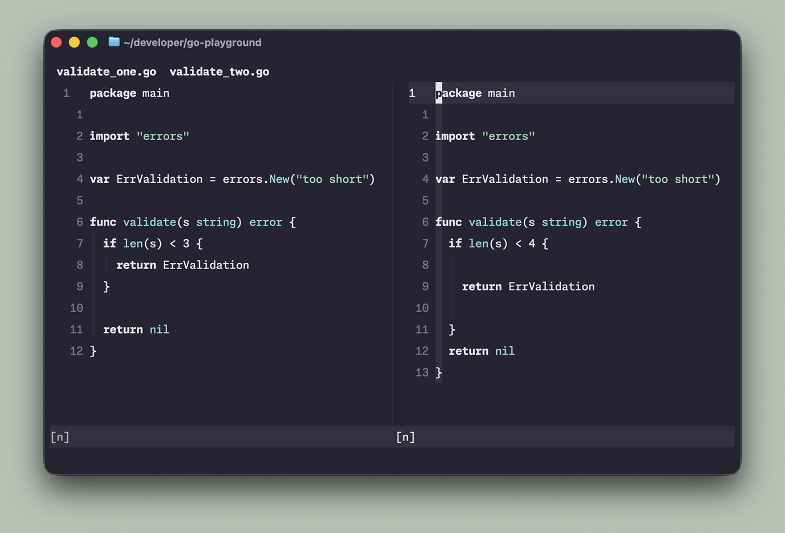
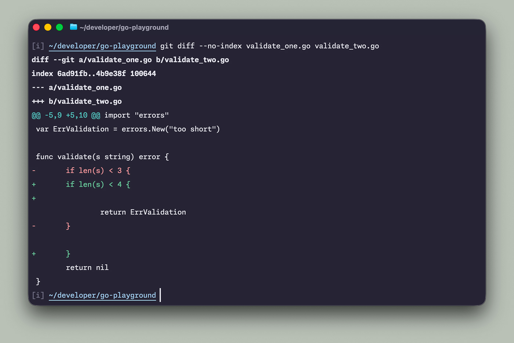
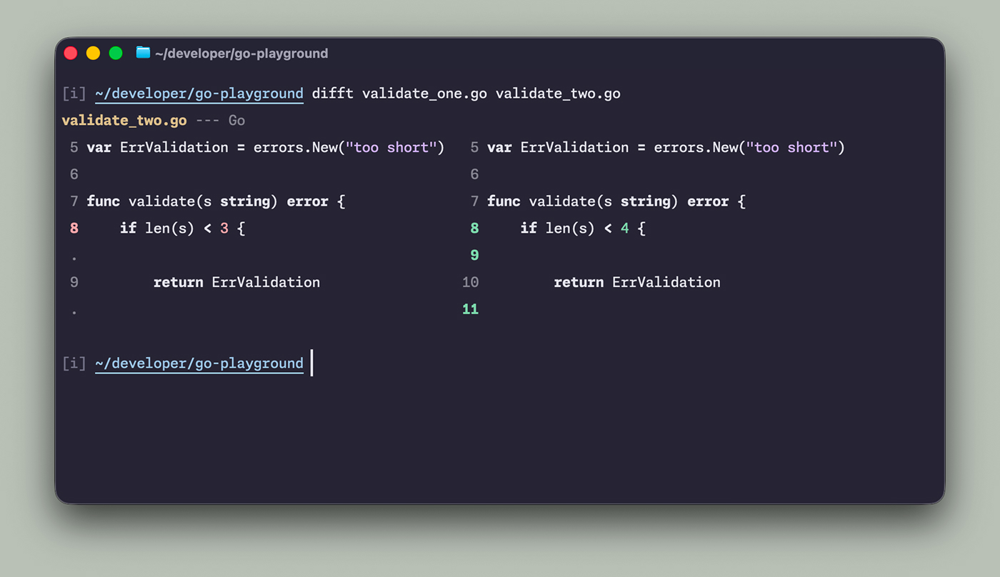

I abandoned graphical code editors years ago. Something that GUI IDEs like Visual Studio Code do really well is the diff preview. This is something I missed a little at the beginning, but since [I started using Delta](/better-git-diff-with-delta/), I never missed the GUI again.

I don't remember how that happened, but over the years I also abandoned Delta, and I trained my eye to be good at scanning the default `git diff` output. Occasionally I still miss side-by-side view though. Recently my good friend [Oliver](https://oliverjash-me.vercel.app/) recommended [Difftastic](https://github.com/Wilfred/difftastic) to me. It works fundamentally different than [Delta](https://github.com/dandavison/delta), and can be used as an individual diff tool to compare files/folders or as a `git diff` pager. Let's look at the example.



```go
package main

import "errors"

var ErrValidation = errors.New("too short")

func validate(s string) error {
	if len(s) < 3 {
		return ErrValidation
	}

	return nil
}
```

```go
package main

import "errors"

var ErrValidation = errors.New("too short")

func validate(s string) error {
	if len(s) < 4 {

		return ErrValidation

	}
	return nil
}
```

The only meaningful difference that is actually interesting is the value change (`3` vs `4`). There are some spacing differences between the two files that I deliberately added to better illustrate how it handles noise. Now look at the output of the default `git diff` and `difft`.





Difftastic gives a super minimalistic result that doesn't clutter the output with noise like white spaces or added removed lines. It respects my terminal theme, and very nicely integrates with git diff and my beloved LazyGit. This is a little addition to my setup, but I like it a ton!
