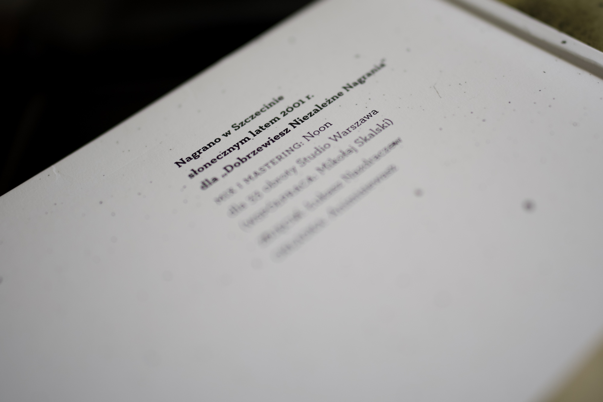

If there is one software theme that dominated this month, it must be either related to npm vulnerabilities or changes in the pricing of frontier AI models. Neither of these subjects interests me in the slightest, so I prepared for you a few links that are not related to these two at all. Google IO also happened a few days ago, and although it was mostly a series of another AI announcements, a few bits are very interesting.

In the past month, I worked super hard on a side project that I have been developing for months at this point, and I can’t wait to present it to you all. I didn't have a lot of time for blogging, but I’m learning tons about Go, backend and distributed systems, but in between, I have tons of fun using some incredible bits of modern CSS on the frontend layer. Stay tuned, folks, and now straight to the music recommendation and some good links from the past month.

---

## Album of the month

The point of this section is to share what I have been listening to the most in the past month, and you're unlucky unless you understand Polish language. Sorry! This month I must dedicate to "Koniec Żartów" by Łona, a great rapper from my hometown, Szczecin. I know the lyrics of every song on this LP, and even though this one is 25 years old, the lyrics still feel fresh. ["Rozmowa z Bogiem"](https://youtu.be/OMXpf2UvYoQ) is my absolute favourite one!

---

## Top picks

### [DO_NOT_TRACK](https://donottrack.sh/)

Great proposal for the universal environment flag that signals that the user doesn't want to send any tracking, usage reporting, telemetry, crash info and others to the software creators. A single flag to rule them all, because at the moment it is a wild west and every tool does it in its own way.

### ["The text mode lie: why modern TUIs are a nightmare for accessibility" by Casey Reeves ](https://xogium.me/the-text-mode-lie-why-modern-tuis-are-a-nightmare-for-accessibility)

Very interesting read about the state of the accessibility of TUI tools written in frameworks like React Ink or Go-based Bubble Tea. I'm sure you have seen them; I personally use some of them quite a lot, but I'm not visually impaired. For blind users, they are impossible to use, and maintainers of huge tools like `gemini-cli` simply ignore it despite plenty of reports. I often think about the experience of visually impaired users of my web projects, and TUI creators should do the same. I'm in the process of building my first TUI tool, and I'll keep the advice from this post in mind.

### ["font-family Doesn’t Fall Back the Way You Think" by Harry Roberts](https://csswizardry.com/2026/04/font-family-doesnt-fall-back-the-way-you-think/)

Harry was right, I didn't know about it. I love CSS so much and feel a little embarrassed every time I learn basic concepts like this. I didn't know about the `font-family` fallback strategy, so maybe you don't know about it either. Check it out, Harry is a good web fella!

### ["I'm an idiot" by Dave Letorey](https://letorey.co.uk/thoughts/i-am-an-idiot/)

Dave is not an idiot. You may know him from his incredible contributions to MDN, he literally documented half of the CSS there. Also, he is an organiser of my favourite, super community-focused web conference, [State of the Browser](https://2026.stateofthebrowser.com/2027/). Most importantly, he is a good friend! For sure, not an idiot! He shared this fantastic story that many of you can relate to. This is top-class blogging here, folks; go and read it!

### ["Better Browser Caching with No-Vary-Search" by Harry Roberts](https://csswizardry.com/2026/05/better-browser-caching-with-no-vary-search/)

Very good explainer of the experimental "No-Vary-Search" HTTP response header. This single addition to the list of headers coming from the server may save a lot of data sent over the wire. Harry is also a good educator, I have followed him for many years, and his content is always second to none.

### ["LSP and Autocomplete in Neovim Is Finally Native" by Systematician](https://youtu.be/s7zb73fgXqU)

A quick video about the LSP setup with the native autocomplete. Every major release of Neovim, they add really useful stuff to the core. I rarely add any plugins recently, but I remove them quite often, and this video makes me think that maybe I don't need Blink anymore.

### ["Gap decorations: Now available in Chromium" by Javier Contreras and Sam Davis Omekara](https://developer.chrome.com/blog/gap-decorations-stable)

Can’t tell you how many hacks I used to get nice-looking custom borders around the CSS grid items. Pseudo classes, box shadows, background on the parent with a little gap and padding around the parent, you name it. I tried all these tricks. [The CSS Gaps Module Level 1](https://drafts.csswg.org/css-gaps-1/) is really exciting and it is not a little add-on, but a comprehensive spec to go absolutely wild with the look and feel of dividers between CSS grid items. They are animatable! Modern CSS is awesome. This is a super progressively enhancable feature so you don’t need to wait for support on all browsers to start using it. This is a good explainer by two Microsoft folks.

### [CSS is filling the gaps with rules. A way to style gaps in grid and flex.](https://utilitybend.com/blog/css-is-filling-the-gaps-with-rules-a-way-to-style-gaps-in-grid-and-flex)

On the same subject, Brecht De Ruyte published this guide to the new gap decorators. A lot of real life examples on this one. He put a lot of good work into this one so check it out.

### ["Scroll-Driven Animations" by Josh Comeau](https://www.joshwcomeau.com/animation/scroll-driven-animations/)

Another super interactive explainer by Josh. I think I put every single post published by Josh on my top picks list, because they are all so good. This one is no exception. Scroll-driven animations are not that bleeding edge anymore; they are supported by most browsers, and they can be added conditionally only when they are supported. Progressive enhancement for the win! Solid work, Josh, thank you!

### [15 updates from Google IO 2026: Powering the agentic web with new capabilities, tools, and features in Chrome](https://developer.chrome.com/blog/chrome-at-io26)

Google IO was always an event I was looking forward to. This is where Googlers announce what's cool coming to the web and what has been implemented in the last year. This year was not different, because they did announce a lot of stuff, but unfortunately this is not the kind of stuff I was hoping for. As you can imagine, it is all related to AI. Some of the stuff is truly helpful and impressive and for sure worth paying attention to. [Modern Web Guidance](https://developer.chrome.com/docs/modern-web-guidance) is great, probably the same goes for some of the agentic help built into the devtools, and HTML on Canvas is just wild. No matter what your take is on AI fucking everything, probably this list is worth glancing at.
