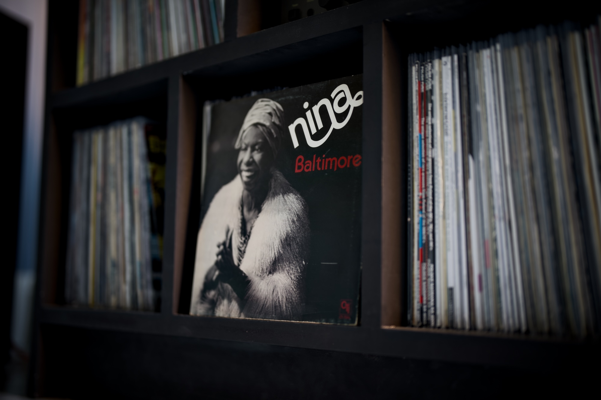

Intro...

---

## Album of the month

Let me tell you a story. I was listening to some music while cooking a breakie for the family the other day. My 3-year-old daughter came down from her bedroom, paused for a moment next to the speaker and asked.

> "Dada, Nina Simone?"

My heart melted and the pride I felt that exact second is hard to describe. My little angel who can barely count to five knows who Nina Simone is. All these music listening sessions and dancing every evening were worth it. The exact song that was playing at that moment was a beautiful song called "Baltimore" (listen to ["Baltimore" by Nina Simone on YouTube](https://youtu.be/ztCgNQg9FCQ)). Even though Nina’s version of this song is by far the most popular, the original was made by Randy Newman in 1977. Beautiful song! Probably no surprise that the album from my collection that I would like to recommend you this month is ["Baltimore" by Nina Simone](https://www.discogs.com/release/29784409-Nina-Baltimore).

PS. If you cook without music, you live your life wrong. A good speaker in the kitchen is essential. And in the bathroom. And the living room. Every room. The garage too!

---

## Top picks

### ["The CSS lh unit" by Ahmad Shadeed](https://ishadeed.com/article/lh-unit/)

I'm glad to see more folks being excited about this, in my opinion super underappreciated, CSS units. The `lh` and `rlh` map to the size of the line height in relation to the current element and the root respectively. This is by far the best way to achieve balanced typography in CSS but as you can see in Ahmad's post, there are plenty of other use cases for it. I also published a piece about three years ago. ["Vertical rhythm using CSS lh and rlh units"](/vertical-rhythm-using-css-lh-and-rlh-units/) give it a go if vertical rhythm on the web is something you care about.

### ["Go 1.27 interactive tour" by Jesus Espino](https://victoriametrics.com/blog/go-1-27/#cut-around-the-last-separator)

Anton Zhiyanov published a bunch of classic blog posts that covered all the new Go releases. It was my favourite way of exploring new things in the language for the past few years. Unfortunately, [Anton decided to stop](https://antonz.org/on-go-tours/), as it started to feel more like a chore rather than a fan project. Luckily, the folks from VictoriaMetrics decided to continue the tradition, and they just published a post about the upcoming Go 1.27 release. It is full of great additions to the language: generics on methods, JSON v2 enabled by default, a built-in UUID package, and plenty more. Thank you for this write-up.

### ["Dark mode toggles: two states are enough" by Lea Verou](https://lea.verou.me/blog/2026/dark-mode-toggles/)

This one is my favourite kind of posts. Lea Verou dives deeply into the user psychology behind the two and three states theme switches. She advocates for the smarter way of programming two-state appearance mode toggles and gives plenty of good reasons against the popular solutions that add third explicit options for adopting system preferences. I'm not fully convinced by her methodology, but nonetheless this is a really good read.

### [_for-sale DNS records](https://specification.website/spec/foundations/for-sale-dns/)

What a brilliant idea. It is shocking that this thing is becoming a reality only now, in 2026. If you want to sell a domain name, just add a `_for_sale` DNS record. Brilliant!

### ["Reminder that `system-ui` is well supported, when you use it on macOS you get San Francisco which is a variable font, which is fun, and the fallbacks are pretty good." by Chris Coyier](https://master.dev/blog/system-ui-san-francisco-fun/)

Fonts contribute a lot to the overall weight of your web project. In this post, Chris reminds us about the system font that often may be more than enough. The default macOS San Francisco font is actually a variable font, and you can go pretty crazy using only this one and nothing else.

### ["Simple Made Easy" - Rich Hickey (2011)](https://youtu.be/SxdOUGdseq4)

One of these talks that I keep coming back to every few years, and every time I watch it I have a feeling that it becomes increasingly more relevant. In the age of AI tools that generate code for programmers, it is so easy for an additional complexity to slip into our project, and the thing is not always immediate to spot. This talk is a good reminder about the correlation of "simple" and "reliable". If you have never watched this talk, today is the day you should hit the play button.

### ["Choose Boring Technology" by Dan McKinley](https://mcfunley.com/choose-boring-technology)

On a similar vein, this is a classic blog post that is over a decade old. A little reminder that goes so well with the "Simple Made Easy" talk. The more I'm a part of this industry, the more I appreciate boring tech. At the same time, I care less and less about shiny new things, and I apply a lot more aggressive filters to the industry news I dedicate any time to. Again, if you have never read this one, brew a coffee now and give it a go.

### [The Case for Tri-State Dark Mode Toggles](https://www.bram.us/2026/08/18/the-case-for-tri-state-dark-mode-toggles/)

This is the counterargument to Lea's post by Bramus. Both posts are very good, and they present two very different points of view, but the prioritisation of explicit user control advocated by Bramus is closer to my preference. I really like this blog post response to another blog post that went viral in the industry.

### ["The True Cost of AI Coding" by Scott Tolinski](https://youtu.be/iPUn1Fnfn0k)

A great presentation of the results that Scott collected on the effect of AI-assisted coding on mental health. Not only dry facts, but also practical advice from psychology experts and some snippets from the interviews with burnt-out developers. If you use any level of AI coding in your day-to-day, this can serve as a good warning. The production quality is, as always, second to none, but at this point, I would expect nothing else from the Syntax folks.

### ["The End of Navel Gazing" by Paul Adams (UX London 2018)](https://vimeo.com/275265188)

I recently had a discussion with some of my tech friends on the [NN1 Dev Club](https://nn1.dev) Discord server about the tech talks that aged well. The one mentioned above by Rich Kickey was, of course, my recommendation, but my friend Rob recommended this one by Paul Adams presented at UX London 8 years ago. This talk aged very well, and other than some obsolete tools at this point, this talk is probably more relevant now than it was back then. If you can think of some old tech talks that aged well, please send them my way!

### [Protobuf now has full LSP support](https://buf.build/blog/protobuf-lsp)

Now when you install Buf CLI, it comes with an LSP server that you can hook into your favourite editor and enjoy a much nicer experience while working with protobufs. That was the missing piece from the official bundle. Protobufs are my favourite way of communication between backend services, and this not only simplifies my tooling to work with it but also makes it more powerful than ever.

### [Reading a performance profile](https://perf.reviews/profile-guide)

A little AI slop warning before you click this one, because it feels like something mostly AI-generated and I think authors should make it a little bit more personal. It is still a very useful collection of explainers related to profiling the performance of your web project. It is a miles-long page and probably reading it from top to bottom is not the way, but skim through the headings and explore the subjects that you don't fully grasp. I learned a ton using it.

### [Go 1.27 is released](https://go.dev/blog/go1.27)

This is a relatively small release compared to some past Go releases, but version 1.27 of my favourite programming language adds quite a few things that I'm really excited about. Generics on methods, more strict JSON encoding, and finally UUID built-in in the standard library. The ["Go 1.27 Release Notes"](https://go.dev/doc/go1.27) go more in depth about every new feature.
