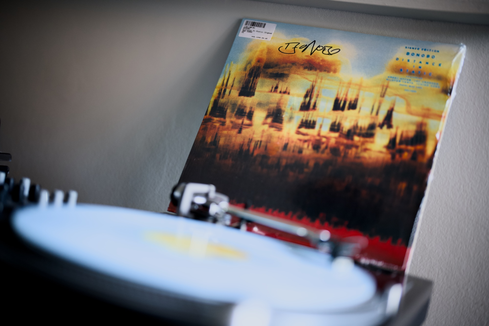

Most of this month we spent at the Polish seaside, with family and friends, chilling at the Baltic Sea, playing cards, grilling fresh fish and enjoying a poor internet connection. The rest of the month I spent trying to understand the madness that happened at work during my absence. But I managed to read some of the interesting bits on the web and also got addicted to a new album by Bonobo. A really successful edition of the [NN1 Dev Club meetup](https://nn1.dev) was a nice way to enter the autumn season. So here you are, a music recommendation straight from my records shelf and a few resources that I found interesting this past month. Enjoy!

---

## Album of the month

Yes, you guessed it, it is [a new Bonobo album, "Distance in Static"](https://www.discogs.com/release/38372355-Bonobo-Distance-In-Static). I love it and this is the one that was spinning on my turntable the most this past month. Lucky me, I managed to get a signed copy from Juno.

---

## Top picks

### [Generic Methods](https://go.dev/blog/generic-methods)

Go 1.18 added generics, but only for standalone functions. Just released Go 1.27 added generics to the methods, so the generics story feels more complete. There is still one missing bit to add generics across the language, as they are not yet supported in the interfaces. This blog post gives a few useful cases for generic methods and also explains the technical limitations of adding them to the interfaces.

### ["Antiquated HTML Snippets and Artefacts" by Declan Chidlow](https://vale.rocks/posts/html-relics)

Declan is one of my favourite bloggers. His deep research into web-related subjects is always super interesting. This one is a huge list of web relics, snippets of HTML that were once popular but are now no longer needed. Again, he must have put a silly amount of effort into this research. I also love some personal annotations on some of the elements, like the Twitter-related meta tags.

### ["CSS Curiosities of the Past" by Declan Chidlow](https://vale.rocks/posts/css-relics)

A natural follow-up, also by Vale, also about the relics of a web programming language. This time about the dated parts of the CSS. I will just stop recommending blog posts by Vale; you should just follow him and read everything he writes. He is one of my favourite bloggers these days and an awesome web folk!

### ["Introducing \<rich-input\>, a GitHub-like search/filter text input to embed on your site" by Bramus](https://www.bram.us/2026/09/14/introducing-rich-input-a-github-like-search-filter-text-input-to-embed-on-your-site/)

What's interesting about this blog post by Bramus is not the web component he announces, but the set of technologies used to build it. I heard tons about the [CSS Custom Highlights API](https://developer.mozilla.org/en-US/docs/Web/API/CSS_Custom_Highlight_API) in the past and I'm well excited about its capabilities, but the OpaqueRange API is totally new to me, and it is awesome! This combination of these two modern APIs will totally change the way we build complex UI elements. Coincidentally, not long ago I have been researching the market to see what options third-party solutions offer, and seeing a truly native solution to do exactly what I need it to do makes me super happy. The ["Highlighting a range of text inside an input or textarea" by Ollie Williams](https://olliewilliams.xyz/blog/opaquerange/) is a good follow up on the subject.

### ["Modern Web Types" by Philip Walton](https://philipwalton.com/articles/modern-web-types/)

Have you ever encountered missing types for the modern web APIs in your TypeScript projects? This project by Philip Walton fills this gap. No more `ts-ignore`s for you, all modern web tinkers.

### [React 19.3](https://react.dev/blog/2026/09/09/react-19-3)

I don’t use React as often as I used to, but this release is pretty cool and comes with a solution to two problems I frequently faced in the past. The Fragment’s references and the native way of detecting the browser environment specifically. The addition of the View Transitions, which are built on top of the [View Transition API](https://developer.mozilla.org/en-US/docs/Web/API/View_Transition_API), is a nice addition to the library for sure. Other than that, there is a bunch of news around server-side rendering that I don’t really know that much about. Overall, a solid release.

### [Cloudflare Quick Tunnels](https://try.cloudflare.com/)

A new feature by Cloudflare to make tunnelling super duper easy. I have been using ngrok for things like that in the past, but this one has become complicated over time and also requires an account. The new Cloudflare CLI makes it seamless and takes only 3 seconds to make your localhost instances remotely available. Handy!

### [The Story of VS Code | Official Documentary](https://youtu.be/kHL3XzjpT5w)

Microsoft did multiple amazing things for software engineering, but TypeScript and Visual Studio Code are two of my favourites amongst them all. I really enjoyed watching this documentary. It is not a dry, boring, technical story, quite the opposite. It is a story of amazing people who met at the Zurich office and built Monaco, which then became the most popular IDE ever used. It goes a lot about the community and the open-source aspect. I really liked the part where they explained the motivation to create an LSP protocol, of which I'm a huge fan. Good background watch and a lovely story about people.

### ["Blurry before beautiful: image previews for the web" by Patrick Brosset](https://patrickbrosset.com/articles/2026-09-22-blurry-before-beautiful-image-previews-for-the-web/)

A new proposal by the Microsoft Edge team to introduce the `previewsrc` attribute to the native `img` HTML element. It's proposed to solve the popular use case of serving a preview image before the full resource is loaded. There are plenty of third-party solutions and also many framework-dependent solutions. It is interesting, but it missed a few considerations about the `alt` text rendering and also the progressive rendering of formats that support it. Reading the discussion under some of [the issues raised against this proposal](https://github.com/MicrosoftEdge/MSEdgeExplainers/issues?q=is%3Aissue%20state%3Aopen%20label%3A%22Image%20Preview%22) is equally interesting as [the proposal itself](https://github.com/MicrosoftEdge/MSEdgeExplainers/blob/main/ImagePreview/explainer.md).

### ["The root scroller and how not to lose it" by Kilian Valkhof](https://polypane.app/blog/the-root-scroller-and-how-not-to-lose-it/)

This is an incredible post by Kilian Valkhof from Polypane that goes in depth about the scrollable elements and all the special properties of the root scroller. I learned a lot from this post and I'm sure you will too. Kilian is an incredible educator and every single article he writes is worth your time.

### ["Node.js built-ins that replaced npm packages" by Flavio Copes](https://flaviocopes.com/node-builtins/)

A common things in Node.js, like project reloading and basic stdout styling, no longer needs a third-party package. Here, Flavio Copes gives us 12 alternatives to very popular things that some time ago were only possible using third-party packages, but now can be achieved using built-ins. Good short summary. I published a post about most of these in the past individually, but it is good to see them all together on a concise list.

### [Go 1.27 Explained by the Go Team | Release Party](https://www.youtube.com/live/UkswvuLfUMQ)

It is hard to beat this way of presenting new features in the recently released Go 1.27. Ainsley Clark and Jesús Espino did a fantastic job hosting it and interviewing no one else but the implementers responsible for all the new parts of the language.

### ["Stop buttons triggering zoom when they’re double tapped" by Andy Bell](https://piccalil.li/blog/stop-buttons-triggering-zoom-when-theyre-double-tapped/)

This article presents a problem that I didn't even know I had, but secondly, it also gives a one-liner solution for it. I also had no clue that this CSS property and value existed. Andy and his Piccalilli blog are one of the very few incredible CSS resources that are still going on the web, and I'm very thankful for it. Top quality as always.

### [Inclusive Design 24 (#id24) 2026 - YouTube Playlist](https://youtube.com/playlist?list=PLFbG3UWnuE3U)

Inclusive Design 24 is a free, 24-hour online event all about accessibility that every year highlights talks by industry experts. Every time it happens, I go through the presentation recordings, and there is plenty of good content to learn from. This year is no different. Me being a web lover, naturally I must recommend ["19½ Things You Didn't Know about Accessibility in HTML and CSS" by Manuel Matuzović](https://www.youtube.com/live/h3JhFyOyzK0), ["How we want to make WCAG better" by Hidde de Vries](https://www.youtube.com/live/tDvdzcbo_tU) and ["Building for People in the Age of AI Agents" by Neha Pandit](https://www.youtube.com/live/b4bD5v3-0FA) to you. These are my favourite cherry picks, but there is plenty of other great content there to choose from.
