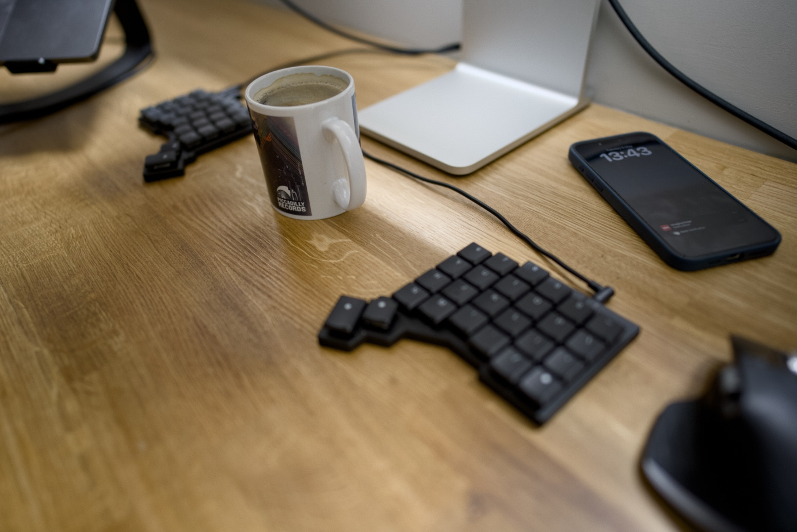

Folks often ask me about the stuff I use. Similiarly, I enjoy reading about the hardware and software used by people who inspire me. Following [the IndieWeb trend](https://indieweb.org/using), here is my list.

## Hardware

- [MacBook Pro M2 14-inch](https://www.apple.com/uk/macbook-pro/) (personal)
- [MacBook Pro M1 16-inch](https://www.apple.com/uk/macbook-pro/) (work)
- [iPad Pro XX generation](https://www.apple.com/uk/ipad-pro/)
- [iPhone 15 Pro Max](https://www.apple.com/uk/iphone-16-pro/)
- [Apple Watch Series 4](https://www.apple.com/uk/apple-watch-series-10/)
- [Logitech MX Master 3S for Mac](https://www.logitech.com/en-gb/shop/p/mx-master-3s-mac-bluetooth-mouse.910-006571)
- [ZSA Voyager split ergonomic keyboard](https://www.zsa.io/voyager)

## Software

[I like defaults](/my-defaults-2023/) a lot, but besides that, I use some software that does not come pre-installed. Here is a list of the ones that I use most frequently.

- Password manager: [1Password](https://1password.com/)
- RSS reader: [Reeder Classic](https://reederapp.com/classic/)
- Launcher: [Raycast](https://www.raycast.com/)
- Terminal client: [Ghostty](https://ghostty.org/)
- Text editor: [Neovim](https://neovim.io/)

## Photography

- [Sony α7R III](https://www.sony.co.uk/electronics/interchangeable-lens-cameras/ilce-7rm3) (body)
- [Sony FE 85mm F1.4 GM](https://www.sony.co.uk/store/product/sel85f14gm.syx/FE-85mm-F1-4-GM) (lens)
- [Sony FE 24mm F1.4 GM](https://www.sony.co.uk/store/product/sel24f14gm.syx/FE-24mm-F1-4-GM) (lens)
- [Hasselblad 500C](https://www.hasselblad.com/about/history/500-series/) (body)
- Zeiss Planar 80mm f/2.8 C (lens)
- Nikon FM2 (body)
- Nikon 35mm f/2 (lens)
